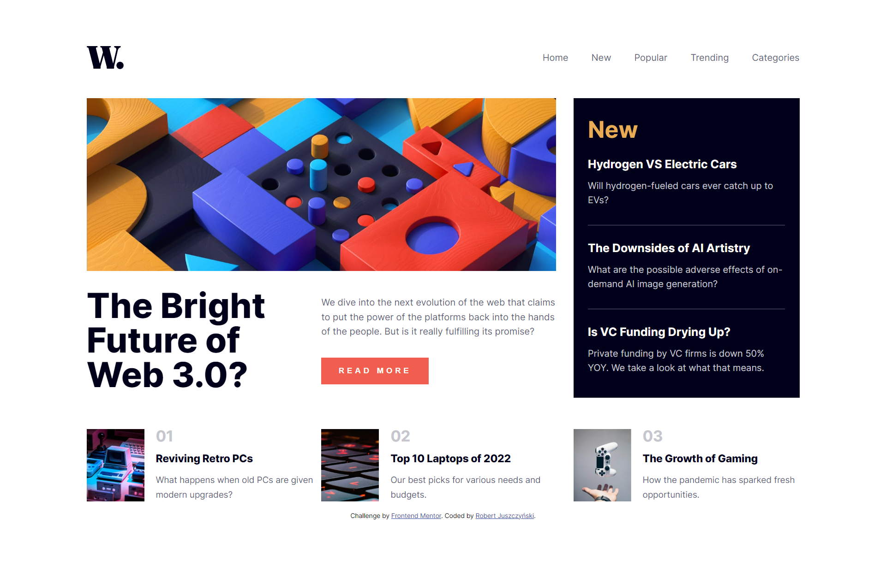

# Frontend Mentor - News homepage solution

This is a solution to the [News homepage challenge on Frontend Mentor](https://www.frontendmentor.io/challenges/news-homepage-H6SWTa1MFl). Frontend Mentor challenges help you improve your coding skills by building realistic projects. 

## Table of contents

- [Overview](#overview)
  - [The challenge](#the-challenge)
  - [Screenshot](#screenshot)
  - [Links](#links)
- [My process](#my-process)
  - [Built with](#built-with)
  - [What I learned](#what-i-learned)
  - [Continued development](#continued-development))

## Overview

### The challenge

Users should be able to:

- View the optimal layout for the interface depending on their device's screen size
- See hover and focus states for all interactive elements on the page

### Screenshot

### Links

- Solution URL: [Solution](https://www.frontendmentor.io/solutions/responsive-news-homepage-using-grid-flex-and-light-javascript-43J6RWctoi)
- Live Site URL: [Live Site](https://amadeuszrb.github.io/frontend-mentor-NewsHomepage/)

## My process

### Built with

- Semantic HTML5 markup
- CSS custom properties
- Flexbox
- CSS Grid
- Light JavaScript

### What I learned

I learned to use the Grid layout technology better in practice, I encountered a few problems, which will prevent them from repeating in the future. I spent a lot of time perfecting the look of the site to match the look of the site I was about to recreate.

### Continued development

I'm going to focus more on JavaScript, improve my skills of arranging and managing elements on the page.

